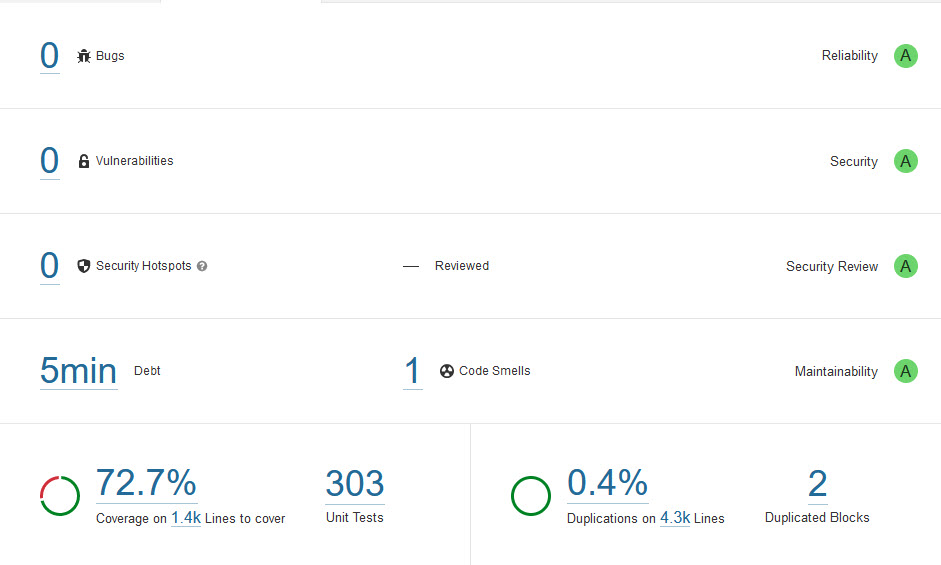

# Crypto Primitives Domain

## What is the content of this repository?

The Crypto-primitives-domain library encapsulates the data objects that are produced by the e-voting system and consumed by a verifier. It acts as a
documentation of the interface between these two systems.

## Under which license is this code available?

The crypto-primitives-domain library is released under Apache 2.0.

## Code Quality

We strive for excellent code quality to minimize the risk of bugs and vulnerabilities. We rely on the following tools for code analysis.

| Tool                                                                                    | Focus                                                                                              |
|-----------------------------------------------------------------------------------------|----------------------------------------------------------------------------------------------------|
| [SonarQube](https://www.sonarqube.org/)                                                 | Code quality and code security                                                                     |
| [Fortify](https://www.microfocus.com/de-de/products/static-code-analysis-sast/overview) | Static Application Security Testing                                                                |
| [JFrog X-Ray](https://jfrog.com/xray/)                                                  | Common vulnerabilities and exposures (CVE) analysis, Open-source software (OSS) license compliance | |

### SonarQube Analysis

We parametrize SonarQube with the built-in Sonar way quality profile. The SonarQube analysis of the crypto-primitives-domain code reveals 0 bugs, 0
vulnerabilities, 0 security hotspots, and 3 code smells.

The 2 code smells concern a deprecated duplicated blocks rule. We left the code blocks as is since removing them reduces the code's readability.

### Fortify Analysis

The Fortify analysis showed 0 critical, 0 high, 0 medium, and 1 low criticality issues. We manually reviewed the low-criticality issue and assessed it
as false positive.

### JFrog X-Ray Analysis

The X-Ray analysis indicates that none of the crypto-primitives-domain' 3rd party dependencies contains known vulnerabilities or non-compliant open
source software licenses. As a general principle, we try to minimize external dependencies in cryptographic libraries and only rely on well-tested and
widely used 3rd party components.

## Changelog

An overview of all major changes within the published releases is available [here.](CHANGELOG.md)

## Future work

We plan for the following improvements to the crypto-primitives-domain library:

* Encapsulate ids (ballot box IDs, voting card set id, election event id) in objects.
* Migrate the Crypto-primitives-domain library into the evoting-libraries repository.
